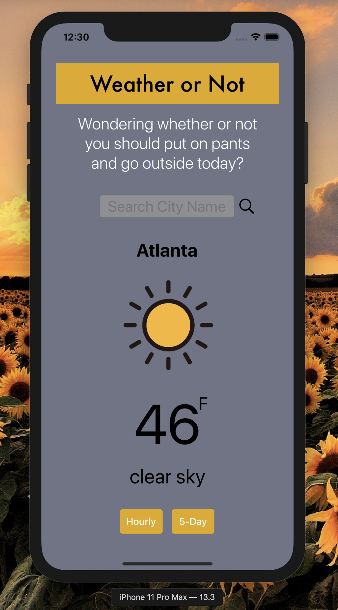
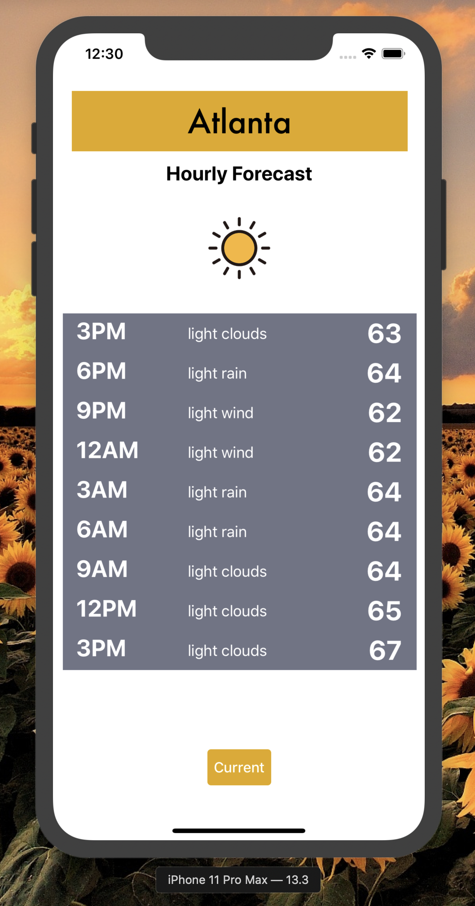
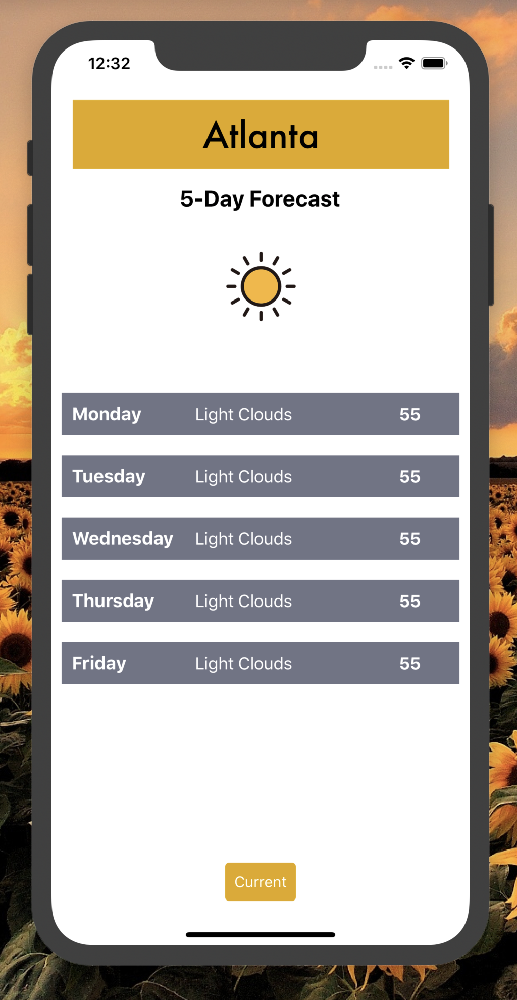

# Onramp iOS Take-Home Project 

## Weather Or Not created by Rose Egle

### Project Summary:

Weather Or Not is a weather app that uses the OpenWeather api to make a request based on what city the user types into the textfield and then presents the data that is sent back to the user.  It has an MVVM architecture design pattern, the Models represent simple data and are instantiated within the ViewModels.  The ViewModels do all of the networking, and data preparation for visual representation that will be used by the ViewController.  This part is very crucial to the MVVM architecture.  In MVC the controllers control the UI but are also in charge of fetching and parsing the data from the API.  The way that I have used the ViewModel in this app separates those concerns and takes the load off of the controllers.  In this app the ViewControllers only present the data in the UI and control any UI changes and UI actions based on user interactions.

### Weather Icons Used
[Icon Finder](https://www.iconfinder.com/iconsets/weather-color-2)

### REST API used
[OpenWeather](https://openweathermap.org/current)

## Model

* CurrentWeatherData.swift -  This is used for parsing the JSON from the Current weather API
* CurrentWeatherModel.swift - This sets up the structure of the model that will be created by CurrentWeatherViewModel
* HourlyData.swift - This is used for parsing the JSON from the API
* HourlyModel.swift - This sets up the structure of the model that will be created by ViewModel
* HourlyArrayModel.swift - this groups the individual hourly models into one list based model that is in line with the data structure of the JSON object returned by the 3 hour/5day api

## ViewModel 

* CurrentWeatherViewModel.swift - responsible for all asyncchronous networking code, this is where the api call is actually made and the data is fetched back and then rendered from a JSON object into a model object that the ViewModel then passes to the ViewController so that it can be visually rendered
* HourlyViewModel.swift - responsible for all asyncchronous networking code, this viewModel makes a call to a 3 hour/5day api also made by open weather

## Views

* ViewController.swift - responsible for taking the user input and passing it to the ViewModel and then displaying the response from the api in the UI, also in control of navigation/segues to the other biew controllers through the use of buttons
* SecondViewController.swift - displays a table of mock hourly data
* ThirdViewController.swift - displays a table of mock daily data
* Main.storyboard - The UIView that the ViewControllers are controlling/manipulating

## Data Persistence

* UserDefaults - I set them up within ViewController.swift so that the last city that was searched becomes the default, so that they return to the app it will be displaying that same city's information.  I did this based on the assumption that most people generally stay in their home cities and are not usually looking up the weather in places they do not live  

## User Flow

### ViewController

This is the first screen the user sees

 

They can enter their city into to the textfield and they can either press the magnifying glass search button or they can hit the "GO" key on the keyboard.  This then triggers the fetching of the data from the api.  The city name will be displayed, as well as the temperature, a correlating weather icon and a description of conditions.  From there they can either press the "Hourly" button or "5-day" button which will take them to a different screen.

### SecondViewController

If the hourly button is pressed it will send the user to this screen where they can view a table of mock hourly data.  The user can then press the current button to return to the current weather page or ViewController.swift.

### ThirdViewController

If the 5-Day button is pressed it will send the user to this screen where they can view a table of mock daily data.  The user can then press the current button to return to the current weather page or ViewController.swift.

### Challenges

* As you can see I had a really hard time making my custom table cells display in the same way for both view controllers with tables in them.  Right now they are two separate Cell.xib files and I'm sure I could use the same one for both I just couldn't figure out how.
* I did try to make a second api call to the 3 hour/5day api through the HourlyViewModel.  I was able to get the data easily enough and I was able to pass it forward to my view controller.  But I ran into trouble because the table was being populated in viewDidLoad() and even though I was also fetching the data in viewDidLoad() it was coming back after the table had loaded no matter what I tried, I know it has something to do with the asynchronous data loading.  Since I'd alreay made a succesful api call and rendering with my CurrentWeatherView model and that met the project requirements, I ended up having to just populate the table with mock data, which was not ideal but I will come back to it after your consideration process.

 

